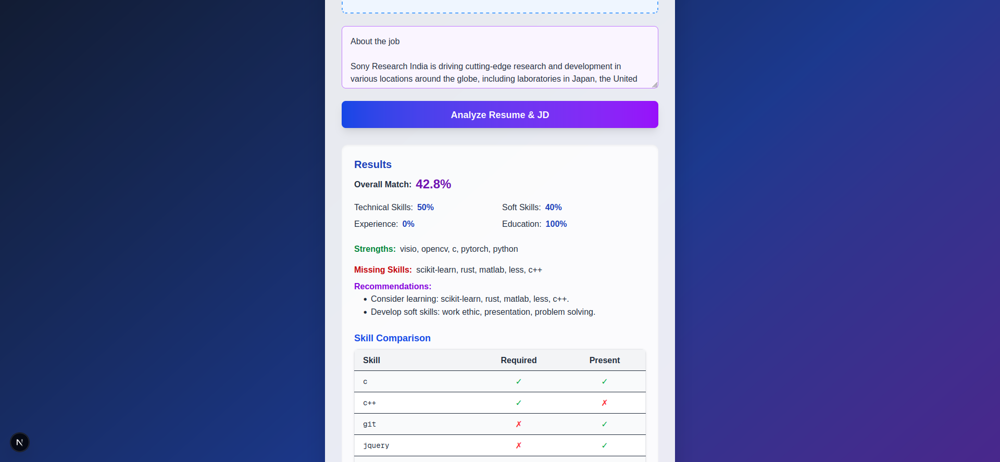
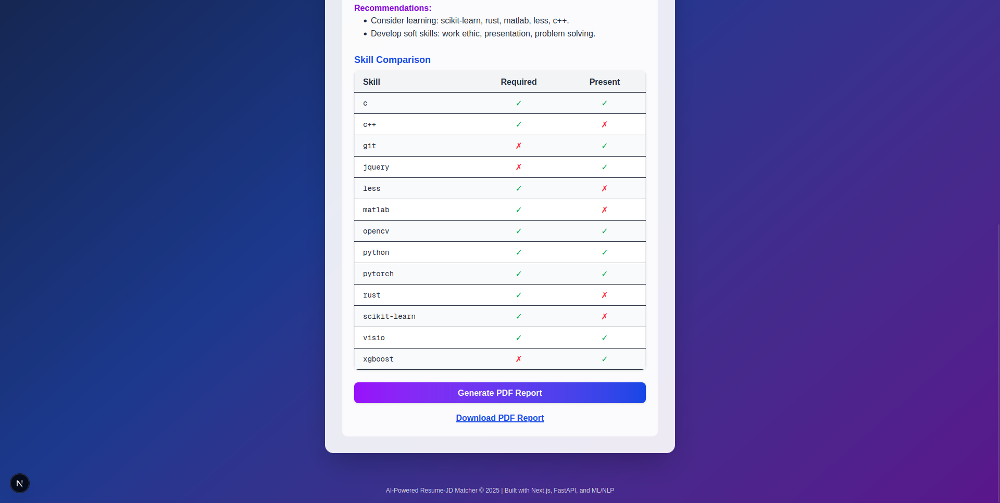

# RJD Parser [Resume - Job Description Parser]



A modern, full-stack application that matches resumes to job descriptions using advanced NLP/ML techniques. Features include:
- Resume and JD upload/input
- Entity and skill extraction (spaCy, fuzzy matching)
- Semantic and category-based matching (Sentence-BERT)
- Detailed, structured report generation (LLM + PDF)
- Side-by-side skill comparison table
- Modern, responsive UI (Next.js + Tailwind)

## Tech Stack
- **Backend:** FastAPI, spaCy (en_core_web_trf), Sentence-BERT, rapidfuzz, fpdf
- **Frontend:** Next.js (React, TypeScript), Tailwind CSS

## Setup Instructions

### 1. Backend
- Python 3.9+ recommended (tested on 3.13)
- Install dependencies:
  ```bash
  cd backend
  python -m venv venv
  source venv/bin/activate
  pip install -r requirements.txt
  python -m spacy download en_core_web_trf
  ```
- Run the FastAPI server:
  ```bash
  uvicorn main:app --reload --host 0.0.0.0 --port 8000
  ```

### 2. Frontend
- Node.js 18+ recommended
- Install dependencies:
  ```bash
  cd frontend
  npm install
  # or yarn install
  ```
- Run the Next.js dev server:
  ```bash
  npm run dev
  # or yarn dev
  ```
- Open [http://localhost:3000](http://localhost:3000)



## Usage
1. Upload your resume (PDF/DOCX) and paste the job description.
2. Click "Analyze Resume & JD" to see the match results, strengths, missing skills, recommendations, and a skill comparison table.
3. Click "Generate PDF Report" to download a detailed, structured report (with skill table).


## Notes
- PDF report uses ASCII ("Yes"/"No") for skill table to avoid Unicode issues.
- If you see errors about missing models, run: `python -m spacy download en_core_web_trf`.
- For GPU LLM report generation, ensure compatible hardware/drivers.

## Troubleshooting
- UnicodeEncodeError in PDF: Only ASCII is used for check/cross marks.
- If PDF is blank or malformed, check for missing fonts or file permissions.
- If LLM report fails, fallback template is used.

## Project Structure
- `backend/` - FastAPI app, ML pipeline, PDF/report logic
- `frontend/` - Next.js app, UI/UX
